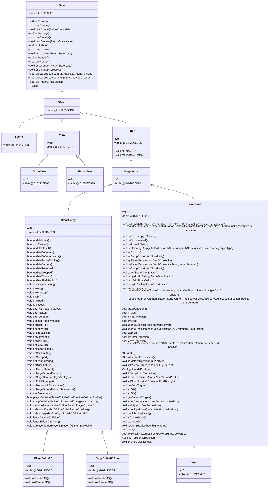

```mermaid
---
title New Super Mario Bros. Class Hierarchy
---
classDiagram

	class Base
	Base : vtable @ 0x02085258
	Base : +s32 onCreate()
	Base : +bool preCreate()
	Base : +void postCreate(ReturnState state)
	Base : +s32 onDestroy()
	Base : +bool preDestroy()
	Base : +void postDestroy(ReturnState state)
	Base : +s32 onUpdate()
	Base : +bool preUpdate()
	Base : +void postUpdate(ReturnState state)
	Base : +s32 onRender()
	Base : +bool preRender()
	Base : +void postRender(ReturnState state)
	Base : +void onCleanupResources()
	Base : +bool prepareResourcesSafe(u32 size, Heap* parent)
	Base : +bool prepareResourcesFast(u32 size, Heap* parent)
	Base : +bool onPrepareResources()
	Base : +~Base()

	class Object
	Base <|-- Object
	Object : vtable @ 0x0203BCD8
	
	class Scene
	Object <|-- Scene
	Scene : vtable @ 0x0203BD38
	
	class View
	Object <|-- View
	View : ov10
	View : vtable @ 0x020C6EAC
	
	class OrthoView
	View <|-- OrthoView
	OrthoView : ov10
	OrthoView : vtable @ 0x02123D08
	
	class PerspView
	View <|-- PerspView
	PerspView : ov8
	PerspView : vtable @ 0x020E5938
	
	class Actor
	Object <|-- Actor
	Actor : ov0
	Actor : vtable @ 0x020C6C2C
	Actor : +void setX(fx32 x)
	Actor : +void moveX(fx32 offset)
	
	class StageActor
	Actor <|-- StageActor
	StageActor : ov0
	StageActor : vtable @ 0x020C6C84

	class StageEntity
	StageActor <|-- StageEntity
	StageEntity : ov0
	StageEntity : vtable @ 0x020C4EFC
	StageEntity : bool updateMain()
	StageEntity : bool skipRender()
	StageEntity : bool updateState1()
	StageEntity : bool updateDefeated()
	StageEntity : bool updateDefeatedMega()
	StageEntity : bool updateFenceTurning()
	StageEntity : bool updateCarried()
	StageEntity : bool updateReleased()
	StageEntity : bool updateDropped()
	StageEntity : bool updateThrown()
	StageEntity : bool updateShellRolling()
	StageEntity : void updateAnimation()
	StageEntity : void thrown()
	StageEntity : void thrownStop()
	StageEntity : void virt34()
	StageEntity : void grabbed()
	StageEntity : void released()
	StageEntity : void shellHit(Player& player)
	StageEntity : void shellKicked()
	StageEntity : void shellStopped()
	StageEntity : void updateFireballWiggle()
	StageEntity : void onBlockHit()
	StageEntity : void onEntityHit()
	StageEntity : void onFireballHit()
	StageEntity : void onStarmanHit()
	StageEntity : void onSlidingHit()
	StageEntity : void onMegaHit()
	StageEntity : void onMegaKicked()
	StageEntity : void onSpinDrillHit()
	StageEntity : void onStomped()
	StageEntity : void onGroundPound()
	StageEntity : void onBlueShellHit()
	StageEntity : void onFenceSlamHit()
	StageEntity : void onMegaGroundPound()
	StageEntity : void onStageBeaten(Player& player)
	StageEntity : void onFatalDamage()
	StageEntity : void onMegaWalkShockwave()
	StageEntity : void onMegaGroundPoundShockwave()
	StageEntity : void stopMovement()
	StageEntity : bool playerCollision(ActiveCollider& self, ActiveCollider& other)
	StageEntity : void entityCollision(ActiveCollider& self, StageActor& actor)
	StageEntity : void damagePlayer(ActiveCollider& self, Player& player)
	StageEntity : void defeat(fx32 velX, fx32 velY, fx32 accelY, u8 arg)
	StageEntity : void defeatMega(fx32 velX, fx32 velY, fx32 accelY)
	StageEntity : void fenceDisableCollision()
	StageEntity : void fenceSwitchDirection()
	StageEntity : void doPlayerJump(Player& player, fx32 jumpVelocity)
	
	class StageEntity3D
	StageEntity <|-- StageEntity3D
	StageEntity3D : ov10
	StageEntity3D : vtable @ 0x02123DBC
	StageEntity3D : void preRender3D()
	StageEntity3D : void postRender3D()
	
	class StageEntity3DAnm
	StageEntity <|-- StageEntity3DAnm
	StageEntity3DAnm : ov10
	StageEntity3DAnm : vtable @ 0x02123ED8
	StageEntity3DAnm : void preRender3D()
	StageEntity3DAnm : void postRender3D()
	
	class PlayerBase
	StageActor <|-- PlayerBase
	PlayerBase : ov11
	PlayerBase : vtable @ 0x0212F72C
	PlayerBase : bool doJump(fx32 force, u16 duration, bool playSFX, bool noConsecutive, s8 variation)
	PlayerBase : bool doJumpEx(fx32 force, u16 duration, u8 lockHorizontalDuration, bool playSFX, bool noConsecutive, s8 variation)
	PlayerBase : bool doSpinJump(fx32 force)
	PlayerBase : bool doBounceWhirl()
	PlayerBase : bool doTornadoWhirl()
	PlayerBase : bool dealDamage(StageActor& actor, fx32 velocityX, fx32 velocityY, PlayerDamageType type)
	PlayerBase : bool tryCrouch()
	PlayerBase : bool tryBump(const Vec2& velocity)
	PlayerBase : bool tryPlayerBump(const Vec2& velocity)
	PlayerBase : bool doPlayerBump(const Vec2& velocity, bool groundPounded)
	PlayerBase : bool doBump(const Vec2& velocity)
	PlayerBase : bool carry(StageActor& actor)
	PlayerBase : bool hangMiniToCeiling(StageActor& actor)
	PlayerBase : bool dropMiniFromCeiling()
	PlayerBase : bool hangToCeiling(StageActor& actor)
	PlayerBase : bool dropFromCeiling()
	PlayerBase : bool waitInCannon(StageActor& cannon, const Vec3& position, s16 angleX, s16 angleY)
	PlayerBase : bool shootFromCannon(StageActor& cannon, fx32 curveForce, s16 curveAngle, s16 direction, bool32 worldCannon)
	PlayerBase : bool grabPendulum()
	PlayerBase : bool virt39()
	PlayerBase : bool isNotClimbing()
	PlayerBase : bool trySlide()
	PlayerBase : void updateCollision(bool damagePlayer)
	PlayerBase : void updatePosition(const Vec3& position, s16 rotationY, u8 direction)
	PlayerBase : bool stomp()
	PlayerBase : bool tryEnterTransition()
	PlayerBase : bool leaveTransition()
	PlayerBase : void setPerspectiveTransform(fx32 scale, const Vec3s& rotation, const Vec3& position)
	PlayerBase : s32 virt48()
	PlayerBase : s32 doTurntableTransition()
	PlayerBase : void doVictoryTransition(u32 playerID)
	PlayerBase : void setVictoryTarget(fx32 x, fx32 y, fx32 z)
	PlayerBase : Vec3 getHandsPosition()
	PlayerBase : void doWarpZoneTransition()
	PlayerBase : void doDoorTransition(const Vec3& doorPosition)
	PlayerBase : void setSpinBlock(fx32 positionX, s16 angle)
	PlayerBase : bool getDoorTrigger()
	PlayerBase : bool virt57()
	PlayerBase : bool virt58()
	PlayerBase : bool getCannonTrigger()
	PlayerBase : void enterCannon(const Vec3& cannonPosition)
	PlayerBase : void virt61(const Vec3& position)
	PlayerBase : void enterPipeDown(const Vec3& pipePosition)
	PlayerBase : bool doLightningShock()
	PlayerBase : bool isControllable()
	PlayerBase : bool paralyze()
	PlayerBase : void setJumpTables(bool higherJump)
	PlayerBase : bool bury()
	PlayerBase : bool trySwitchPowerupDirect(PowerupState powerup)
	PlayerBase : Vec3 getTopSensorPosition()
	PlayerBase : void onOneUpCollected()
	
	class Player
	PlayerBase <|-- Player
	Player : ov10
	Player : vtable @ 0x021284E0

```
