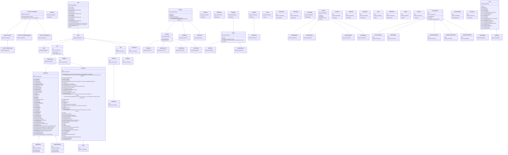

```mermaid
---
title New Super Mario Bros. Class Hierarchy
---
classDiagram

	%% Entity
	class Base
	Base : vtable @ 0x02085258
	Base : s32 onCreate()
	Base : bool preCreate()
	Base : void postCreate(ReturnState state)
	Base : s32 onDestroy()
	Base : bool preDestroy()
	Base : void postDestroy(ReturnState state)
	Base : s32 onUpdate()
	Base : bool preUpdate()
	Base : void postUpdate(ReturnState state)
	Base : s32 onRender()
	Base : bool preRender()
	Base : void postRender(ReturnState state)
	Base : void onCleanupResources()
	Base : bool prepareResourcesSafe(u32 size, Heap* parent)
	Base : bool prepareResourcesFast(u32 size, Heap* parent)
	Base : bool onPrepareResources()
	Base : ~Base()

	class Object
	Base <|-- Object
	Object : vtable @ 0x0203BCD8
	
	class Scene
	Object <|-- Scene
	Scene : vtable @ 0x0203BD38
	
	class Actor
	Object <|-- Actor
	Actor : ov0
	Actor : vtable @ 0x020C6C2C
	Actor : +void setX(fx32 x)
	Actor : +void moveX(fx32 offset)
	
	%% Graphics
	class FadeMask
	FadeMask : vtable @ 0x0203BD8C
	FadeMask : ~FadeMask()
	
	class `Particle::ControllerBase`
	`Particle::ControllerBase` : vtable @ 0x0203CFD4
	`Particle::ControllerBase` : void spawn(SPLEmitter* emitter)
	`Particle::ControllerBase` : bool destroy(SPLEmitter* emitter, bool generate)
	
	class `Particle::Controller`
	`Particle::ControllerBase` <|-- `Particle::Controller`
	`Particle::Controller` : vtable @ 0x0203CFB4
	
	class `Particle::ControllerLiquid`
	`Particle::Controller` <|-- `Particle::ControllerLiquid`
	`Particle::ControllerLiquid` : vtable @ 0x0203CFC4
	
	class `Particle::ControllerManualLiquid`
	`Particle::ControllerBase` <|-- `Particle::ControllerManualLiquid`
	`Particle::ControllerManualLiquid` : vtable @ 0x0203CFA4
	
	class `Particle::ControllerManual`
	`Particle::ControllerBase` <|-- `Particle::ControllerManual`
	`Particle::ControllerManual` : vtable @ 0x0203CF94
	
	%% Graphics.2D
	class FontBase
	FontBase : vtable @ 0x0203C09C
	FontBase : ~FontBase()
	FontBase : void prepare()
	FontBase : void onStringDispatched()
	FontBase : void processChar(UTF16Character* c)
	FontBase : void parseEscapeSequence(EscapeSequence* sequence)
	
	class FontCache
	FontBase <|-- FontCache
	FontCache : vtable @ 0x0203C10C
	FontCache : u32 getCacheSize()
	FontCache : u16* getCachePtr()

	class StringCache
	FontCache <|-- StringCache
	StringCache : vtable @ 0x0203C15C

	class NicknameCache
	FontCache <|-- NicknameCache
	NicknameCache : vtable @ 0x0203C134

	class NumberCache
	FontCache <|-- NumberCache
	NumberCache : vtable @ 0x0203C0BC

	class GenericCache
	FontCache <|-- GenericCache
	GenericCache : vtable @ 0x0203C0E4

	class FontBounds
	FontBase <|-- FontBounds
	FontBounds : vtable @ 0x0203C07C

	class FontString
	FontString : vtable @ 0x0203C034
	FontString : ~FontString()

	class FontRenderer
	FontBase <|-- FontRenderer
	FontRenderer : vtable @ 0x0203C05C

	class BMGReader
	BMGReader : vtable @ 0x0203C024
	BMGReader : ~BMGReader()

	%% Graphics.3D
	class ModelBase
	ModelBase : vtable @ 0x0203C4B4
	ModelBase : ~ModelBase()
	
	class Model
	ModelBase <|-- Model
	Model : vtable @ 0x0203C514
	Model : void null()
	Model : void render(const VecFx32* scale)
	Model : void render(const MtxFx43& transform, const VecFx32* scale)
	Model : void render()
	
	class ModelAnm
	Model <|-- ModelAnm
	ModelAnm : vtable @ 0x0203C4F4
	
	class BlendModelAnm
	Model <|-- BlendModelAnm
	BlendModelAnm : vtable @ 0x0203C4D4
	
	class Animation
	Animation : vtable @ 0x0203C4A4
	Animation : ~Animation()
	
	class AnimationCtrl
	Animation <|-- AnimationCtrl
	AnimationCtrl : vtable @ 0x0203C4C4
	
	class Texture
	Texture : vtable @ 0x0203C494
	Texture : ~Texture()

	%% Graphics.Util
	class View
	Object <|-- View
	View : ov10
	View : vtable @ 0x020C6EAC
	
	class OrthoView
	View <|-- OrthoView
	OrthoView : ov10
	OrthoView : vtable @ 0x02123D08
	
	class PerspView
	View <|-- PerspView
	PerspView : ov8
	PerspView : vtable @ 0x020E5938
	
	%% Physics
	class ActiveCollider
	ActiveCollider : ov0
	ActiveCollider : vtable @ 0x020C6F08
	ActiveCollider : ~ActiveCollider()
	
	class CollisionMgr
	CollisionMgr : ov0
	CollisionMgr : vtable @ 0x020C7000
	CollisionMgr : ~CollisionMgr()
	
	class PlatformMgr
	PlatformMgr : vtable @ 0x0203C620
	PlatformMgr : ~PlatformMgrg()
	
	class Platform
	Platform : vtable @ 0x0203C6A0
	Platform : ~Platform()
	Platform : void update()
	Platform : void resolveCollision()
	Platform : void virt5()
	
	class RotatingPlatform
	Platform <|-- RotatingPlatform
	RotatingPlatform : vtable @ 0x0203C64C
	
	class SegmentPlatform
	Platform <|-- SegmentPlatform
	SegmentPlatform : vtable @ 0x0203C684
	
	class DeformingPlatform
	Platform <|-- DeformingPlatform
	DeformingPlatform : vtable @ 0x0203C668
	
	class RoundPlatform
	Platform <|-- RoundPlatform
	RoundPlatform : vtable @ 0x0203C630

	%% Player
	class PlayerCap
	PlayerCap : ov11
	PlayerCap : vtable @ 0x0212F8B0
	PlayerCap : ~PlayerCap()
	
	class PlayerShell
	PlayerShell : ov11
	PlayerShell : vtable @ 0x0212F8C0
	PlayerShell : ~PlayerShell()
	
	class PlayerModel
	PlayerModel : ov11
	PlayerModel : vtable @ 0x0212F860
	PlayerModel : ~PlayerModel()
	
	%% Stage
	class Effect
	Effect : ov10
	Effect : vtable @ 0x02126A24
	Effect : ~Effect()
	
	class EffectHandler
	EffectHandler : ov10
	EffectHandler : vtable @ 0x02126A04
	EffectHandler : ~EffectHandler()
	
	class Fireball
	Fireball : ov10
	Fireball : vtable @ 0x02126784
	Fireball : ~Fireball()
	
	class Projectile
	Projectile : ov10
	Projectile : vtable @ 0x02126A6C
	Projectile : ~Projectile()
	
	class ProjectileModel
	ProjectileModel : ov10
	ProjectileModel : vtable @ 0x02126A7C
	ProjectileModel : ~ProjectileModel()
	ProjectileModel : bool create()
	ProjectileModel : void render(Projectile& projectile)

	class BoomerangModel
	ProjectileModel <|-- BoomerangModel
	BoomerangModel : ov10
	BoomerangModel : vtable @ 0x02126AA4
	
	class HammerModel
	ProjectileModel <|-- HammerModel
	HammerModel : ov10
	HammerModel : vtable @ 0x02126ACC
	
	class SledgehammerModel
	ProjectileModel <|-- SledgehammerModel
	SledgehammerModel : ov10
	SledgehammerModel : vtable @ 0x02126AF4
	
	class MummipokeyStoneModel
	ProjectileModel <|-- MummipokeyStoneModel
	MummipokeyStoneModel : ov10
	MummipokeyStoneModel : vtable @ 0x02126B1C
	
	class DryBowserBoneModel
	ProjectileModel <|-- DryBowserBoneModel
	DryBowserBoneModel : ov10
	DryBowserBoneModel : vtable @ 0x02126B44
	
	class StageCamera
	OrthoView <|-- StageCamera
	StageCamera : ov10
	StageCamera : vtable @ 0x02123CB8
	
	class ProjectileHandler
	ProjectileHandler : ov10
	ProjectileHandler : vtable @ 0x02126A5C
	ProjectileHandler : ~ProjectileHandler()
	
	class StageController
	Actor <|-- StageController
	StageController : vtable @ 0x0203CF28
	
	class StageActor
	Actor <|-- StageActor
	StageActor : ov0
	StageActor : vtable @ 0x020C6C84

	class StageEntity
	StageActor <|-- StageEntity
	StageEntity : ov0
	StageEntity : vtable @ 0x020C4EFC
	StageEntity : bool updateMain()
	StageEntity : bool skipRender()
	StageEntity : bool updateState1()
	StageEntity : bool updateDefeated()
	StageEntity : bool updateDefeatedMega()
	StageEntity : bool updateFenceTurning()
	StageEntity : bool updateCarried()
	StageEntity : bool updateReleased()
	StageEntity : bool updateDropped()
	StageEntity : bool updateThrown()
	StageEntity : bool updateShellRolling()
	StageEntity : void updateAnimation()
	StageEntity : void thrown()
	StageEntity : void thrownStop()
	StageEntity : void virt34()
	StageEntity : void grabbed()
	StageEntity : void released()
	StageEntity : void shellHit(Player& player)
	StageEntity : void shellKicked()
	StageEntity : void shellStopped()
	StageEntity : void updateFireballWiggle()
	StageEntity : void onBlockHit()
	StageEntity : void onEntityHit()
	StageEntity : void onFireballHit()
	StageEntity : void onStarmanHit()
	StageEntity : void onSlidingHit()
	StageEntity : void onMegaHit()
	StageEntity : void onMegaKicked()
	StageEntity : void onSpinDrillHit()
	StageEntity : void onStomped()
	StageEntity : void onGroundPound()
	StageEntity : void onBlueShellHit()
	StageEntity : void onFenceSlamHit()
	StageEntity : void onMegaGroundPound()
	StageEntity : void onStageBeaten(Player& player)
	StageEntity : void onFatalDamage()
	StageEntity : void onMegaWalkShockwave()
	StageEntity : void onMegaGroundPoundShockwave()
	StageEntity : void stopMovement()
	StageEntity : bool playerCollision(ActiveCollider& self, ActiveCollider& other)
	StageEntity : void entityCollision(ActiveCollider& self, StageActor& actor)
	StageEntity : void damagePlayer(ActiveCollider& self, Player& player)
	StageEntity : void defeat(fx32 velX, fx32 velY, fx32 accelY, u8 arg)
	StageEntity : void defeatMega(fx32 velX, fx32 velY, fx32 accelY)
	StageEntity : void fenceDisableCollision()
	StageEntity : void fenceSwitchDirection()
	StageEntity : void doPlayerJump(Player& player, fx32 jumpVelocity)
	
	class StageEntity3D
	StageEntity <|-- StageEntity3D
	StageEntity3D : ov10
	StageEntity3D : vtable @ 0x02123DBC
	StageEntity3D : void preRender3D()
	StageEntity3D : void postRender3D()
	
	class StageEntity3DAnm
	StageEntity <|-- StageEntity3DAnm
	StageEntity3DAnm : ov10
	StageEntity3DAnm : vtable @ 0x02123ED8
	StageEntity3DAnm : void preRender3D()
	StageEntity3DAnm : void postRender3D()
	
	%% Stage.Layout
	class StageLayout
	Object <|-- StageLayout
	StageLayout : ov0
	StageLayout : vtable @ 0x020C9404
	
	%% Stage.Player
	class VictoryState
	VictoryState : ov11
	VictoryState : vtable @ 0x0212F71C
	VictoryState : ~VictoryState()
	
	class PlayerBase
	StageActor <|-- PlayerBase
	PlayerBase : ov11
	PlayerBase : vtable @ 0x0212F72C
	PlayerBase : bool doJump(fx32 force, u16 duration, bool playSFX, bool noConsecutive, s8 variation)
	PlayerBase : bool doJumpEx(fx32 force, u16 duration, u8 lockHorizontalDuration, bool playSFX, bool noConsecutive, s8 variation)
	PlayerBase : bool doSpinJump(fx32 force)
	PlayerBase : bool doBounceWhirl()
	PlayerBase : bool doTornadoWhirl()
	PlayerBase : bool dealDamage(StageActor& actor, fx32 velocityX, fx32 velocityY, PlayerDamageType type)
	PlayerBase : bool tryCrouch()
	PlayerBase : bool tryBump(const Vec2& velocity)
	PlayerBase : bool tryPlayerBump(const Vec2& velocity)
	PlayerBase : bool doPlayerBump(const Vec2& velocity, bool groundPounded)
	PlayerBase : bool doBump(const Vec2& velocity)
	PlayerBase : bool carry(StageActor& actor)
	PlayerBase : bool hangMiniToCeiling(StageActor& actor)
	PlayerBase : bool dropMiniFromCeiling()
	PlayerBase : bool hangToCeiling(StageActor& actor)
	PlayerBase : bool dropFromCeiling()
	PlayerBase : bool waitInCannon(StageActor& cannon, const Vec3& position, s16 angleX, s16 angleY)
	PlayerBase : bool shootFromCannon(StageActor& cannon, fx32 curveForce, s16 curveAngle, s16 direction, bool32 worldCannon)
	PlayerBase : bool grabPendulum()
	PlayerBase : bool virt39()
	PlayerBase : bool isNotClimbing()
	PlayerBase : bool trySlide()
	PlayerBase : void updateCollision(bool damagePlayer)
	PlayerBase : void updatePosition(const Vec3& position, s16 rotationY, u8 direction)
	PlayerBase : bool stomp()
	PlayerBase : bool tryEnterTransition()
	PlayerBase : bool leaveTransition()
	PlayerBase : void setPerspectiveTransform(fx32 scale, const Vec3s& rotation, const Vec3& position)
	PlayerBase : s32 virt48()
	PlayerBase : s32 doTurntableTransition()
	PlayerBase : void doVictoryTransition(u32 playerID)
	PlayerBase : void setVictoryTarget(fx32 x, fx32 y, fx32 z)
	PlayerBase : Vec3 getHandsPosition()
	PlayerBase : void doWarpZoneTransition()
	PlayerBase : void doDoorTransition(const Vec3& doorPosition)
	PlayerBase : void setSpinBlock(fx32 positionX, s16 angle)
	PlayerBase : bool getDoorTrigger()
	PlayerBase : bool virt57()
	PlayerBase : bool virt58()
	PlayerBase : bool getCannonTrigger()
	PlayerBase : void enterCannon(const Vec3& cannonPosition)
	PlayerBase : void virt61(const Vec3& position)
	PlayerBase : void enterPipeDown(const Vec3& pipePosition)
	PlayerBase : bool doLightningShock()
	PlayerBase : bool isControllable()
	PlayerBase : bool paralyze()
	PlayerBase : void setJumpTables(bool higherJump)
	PlayerBase : bool bury()
	PlayerBase : bool trySwitchPowerupDirect(PowerupState powerup)
	PlayerBase : Vec3 getTopSensorPosition()
	PlayerBase : void onOneUpCollected()
	
	class Player
	PlayerBase <|-- Player
	Player : ov10
	Player : vtable @ 0x021284E0
	
	%% System
	class Heap
	Heap : vtable @ 0x0208519C
	Heap : ~Heap()
	Heap : void lockMutex()
	Heap : void unlockMutex()
	Heap : bool tryLockMutex()
	Heap : void noLockDestroy()
	Heap : void* noLockAllocate(u32 size, s32 align)
	Heap : void noLockDeallocate(void* ptr)
	Heap : void noLockDeallocateAll()
	Heap : bool noLockIntact()
	Heap : void noLockDump()
	Heap : u32 noLockReallocate(void* ptr, u32 newSize)
	Heap : u32 noLockSizeOf(void* ptr)
	Heap : u32 noLockMaxAllocationUnitSize()
	Heap : u32 noLockMaxAllocatableSize()
	Heap : u32 noLockMaxAllocatableSize(s32 align)
	Heap : u32 noLockMemoryLeft()
	Heap : u16 noLockSetGroupID(u16 id)
	Heap : u16 noLockGetGroupID()
	Heap : u32 noLockResizeToFit()
	
	class ExpandedHeap
	Heap <|-- ExpandedHeap
	ExpandedHeap : vtable @ 0x020850EC
	
	class FrameHeap
	Heap <|-- FrameHeap
	FrameHeap : vtable @ 0x02085144
	
```
